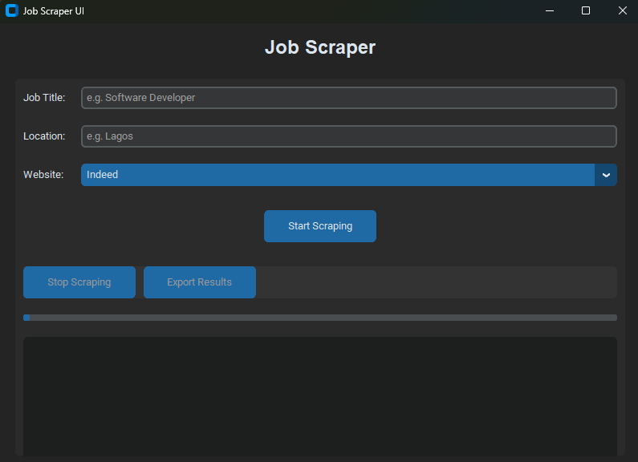

# Job Scraper UI

A modern, user-friendly desktop application for scraping job listings from popular job boards. Built with Python and CustomTkinter, this tool provides an intuitive interface for searching and exporting job data.

## Features

- 🎨 Modern dark-themed UI with CustomTkinter
- 🔍 Search jobs by title and location
- 🌐 Support for multiple job boards (Indeed, LinkedIn, Glassdoor)
- ⏸️ Start/Stop scraping controls
- 📊 Real-time progress tracking
- 📝 Live logging of scraping activities
- 💾 Export results to CSV format
- 🧵 Multi-threaded scraping (non-blocking UI)

## Screenshots



## Requirements

- Python 3.7 or higher
- See `requirements.txt` for package dependencies

## Installation

1. **Clone the repository**
   ```bash
   git clone https://github.com/Vine55/Job-Scraper.git

   cd job-scraper
   ```

2. **Create a virtual environment (recommended)**
   ```bash
   python -m venv venv
   
   # On Windows
   venv\Scripts\activate
   
   # On macOS/Linux
   source venv/bin/activate
   ```

3. **Install dependencies**
   ```bash
   pip install -r requirements.txt
   ```

## Usage

1. **Run the application**
   ```bash
   python Scraper.py
   ```

2. **Configure your search**
   - Enter the job title you're looking for (e.g., "Software Developer")
   - Specify the location (e.g., "Lagos")
   - Select the job board from the dropdown menu

3. **Start scraping**
   - Click "Start Scraping" to begin
   - Monitor progress in the progress bar and log panel
   - Click "Stop Scraping" if you want to halt the process

4. **Export results**
   - Once scraping is complete, click "Export Results"
   - Choose a location to save your CSV file
   - Open the CSV in Excel or any spreadsheet application

## CSV Output Format 

The exported CSV file contains the following fields:

| Field | Description |
|-------|-------------|
| Title | Job title |
| Company | Company name |
| Location | Job location |
| Description | Job description/summary |
| Apply Link | URL to apply for the job |
| Source | Job board source (Indeed/LinkedIn/Glassdoor) |
